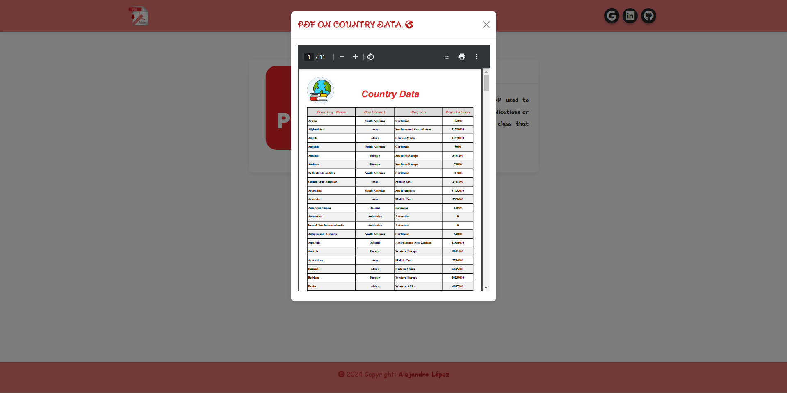

# <h1 align="center" style="color: #80cbc4;"> Dynamic FPDF 👨🏻‍💻 </h1> 
  

` FPDF ` is an open source library written in PHP used to generate PDF documents dynamically from web applications or PHP scripts. FPDF is technically a library or class that provides a set of methods for working with PDF.  

This web program displays data obtained from a database in a table, using FPDF in a file with a .pdf extension to be able to view the extracted data.

    

  

## 
 Requirements 

- [HTML5](https://developer.mozilla.org/es/docs/Web/HTML) 
- [CSS3](https://developer.mozilla.org/es/docs/Web/CSS)
- [PHP](https://www.php.net/manual/es/intro-whatis.php)
- [MySQL](https://dev.mysql.com/)
- [BootStrap](https://mdbootstrap.com/)
- [FPDF](https://www.fpdf.org/)

  

## 
 Screenshot Project 💻 

🔶 [Project Website](https://alejandro-190107.github.io/Dynamic-FPDF/)

.png)  
